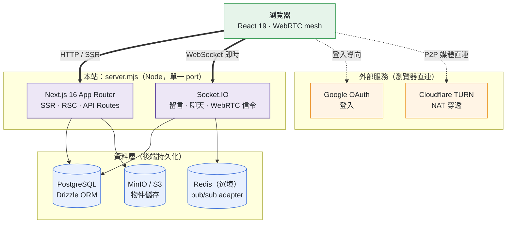

# PetScholar 技術文件

> 北科遊戲化學業交流區（PetScholar）— 結合**論壇討論**、**虛擬寵物養成**與**即時共讀（聊天 / 語音 / 視訊）**的遊戲化校園學業 Q&A 平台。
>
> 本專案原為純前端靜態 Demo，現已遷移並擴充為 **Next.js 全端應用 + 自訂 Socket.IO 伺服器**（真實資料庫、Google 登入、即時通訊、物件儲存、WebRTC），部署於 **Zeabur**。舊靜態站保留在 `legacy/`。

文件日期：2026-06-20 ｜ 版本：0.1.0

---

## 1. 技術棧總覽

| 層級 | 技術 | 版本 / 說明 |
|------|------|-------------|
| 前端框架 | **Next.js**（App Router） | 16.2.9 |
| UI 函式庫 | **React / React DOM** | 19.2.4 |
| 語言 | **TypeScript** | ^5 |
| 樣式 | **Tailwind CSS v4**（`@tailwindcss/postcss`） | ^4，Material 3 設計 token + 深淺模式 |
| 認證 | **Auth.js v5（next-auth）** + `@auth/drizzle-adapter` | 5.0.0-beta.31，Google OAuth、**資料庫 session** |
| 資料庫 | **PostgreSQL** | 透過 `postgres`（postgres.js）^3.4.9 連線 |
| ORM | **Drizzle ORM** + `drizzle-kit` | orm ^0.45.2 / kit ^0.31.10 |
| 即時通訊 | **Socket.IO**（server + client） | ^4.8.3 |
| 跨實例同步 | **Redis** + `@socket.io/redis-adapter` | redis ^6.0.0 / adapter ^8.3.0 |
| 物件儲存 | **MinIO / S3 相容** — `@aws-sdk/client-s3`、`s3-request-presigner` | ^3.1072.0 |
| 即時音視訊 | **WebRTC（mesh 拓樸）** + **Cloudflare TURN** | NAT 穿透；後端動態產生短效 ICE 憑證 |
| AI 降噪 | `@sapphi-red/web-noise-suppressor`（RNNoise WASM worklet） | ^0.3.5 |
| 視訊處理 | `@mediapipe/tasks-vision` | ^0.10.35 |
| 數學式渲染 | **KaTeX** | ^0.17.0 |
| Lint | ESLint + `eslint-config-next` | ^9 |
| 執行環境 | **Node.js**（自訂 server `server.mjs`） | — |
| 部署平台 | **Zeabur** | — |

---

## 2. 架構與「有哪些 Server」

本專案的執行核心是**一支自訂的 Node 伺服器 `server.mjs`**，它在同一個 HTTP server 上同時掛載 Next.js 與 Socket.IO。對外只開一個 port（預設 3000），但邏輯上由以下幾個服務元件組成：

### 2.1 應用伺服器：自訂 Node Server（`server.mjs`）
- 用 Next.js 的 **programmatic API**（`next()`）起 App，並在同一個 `node:http` server 上掛 **Socket.IO**。
- **為何要 custom server**：Next.js App Router 沒有內建長連線 WebSocket 伺服器。自習室聊天/留言即時化需要「即時廣播 + DB 持久化」，故自架。
- 以「純 Node」執行（不經 TS 編譯），故不 import 專案的 TS 模組；DB 存取改用 **postgres.js 直接下 SQL**（schema 與 `db/schema.ts` 的 `chat_message` 一致）。
- `next build` 完全不受此檔影響（custom server 只在 runtime 生效）。
- 機密一律讀 `process.env`（`DATABASE_URL` / `REDIS_URL` 等）。
- 啟動方式：
  - 開發：`npm run dev` → `node server.mjs`（Next dev + 即時）
  - 生產：`npm run build && npm run start` → `NODE_ENV=production node server.mjs`
  - 註：`npm run dev:next`（純 `next dev`）**沒有**即時聊天/語音功能。

### 2.2 即時通訊：Socket.IO Server（內嵌於 `server.mjs`）
- 透過 **Auth.js 資料庫 session cookie** 解析使用者（資料庫 session 策略下，cookie 值即 `session.session_token`，可直接查表驗證）。連線中介層拒絕未授權者。
- 處理三類即時事件：
  - **留言即時化**：`comment:add` → 廣播 `comment:new`；`comment:adopt-notify` → 廣播 `comment:adopted`（文章頁 channel）。
  - **自習室文字聊天**：`chat:*` 事件，含長度限制（`MAX_MESSAGE_LENGTH = 1000`）與歷史載入（`HISTORY_LIMIT = 50`）。
  - **WebRTC 信令 + 房間錄製協調**：`voice:*` 事件。

### 2.3 跨實例 Pub/Sub：Redis（選填）
- 多實例部署時，用 `@socket.io/redis-adapter` 做**跨實例房間廣播同步**。
- **未設定 `REDIS_URL` 時退回單機 in-memory adapter**（單實例仍可正常運作）。

### 2.4 資料庫：PostgreSQL
- 透過 postgres.js 連線（`DATABASE_URL`）。應用層用 **Drizzle ORM**（`db/index.ts` + `db/schema.ts`），custom server 則直接下 SQL。
- 部署時為獨立的 PostgreSQL 服務（Zeabur 提供）。

### 2.5 物件儲存：MinIO / S3 相容服務
- 用 `@aws-sdk/client-s3` + presigned URL 存取。儲存：**自訂頭像、留言/發問附圖、語音/視訊錄製檔**。
- 設定鍵：`S3_ENDPOINT / S3_REGION / S3_ACCESS_KEY / S3_SECRET_KEY / S3_BUCKET`。

### 2.6 NAT 穿透：Cloudflare TURN（外部服務）
- 自習室即時語音/視訊（WebRTC mesh）需要 TURN/STUN 才能穿透對稱型 NAT。
- 後端 `/api/turn` 用 Cloudflare API token **動態產生短效 ICE 憑證**（`TURN_KEY_ID / TURN_API_TOKEN`）。
- **未設定時退回公共 STUN**（對稱型 NAT 可能無法連線）。

### 2.7 第三方：Google OAuth
- 認證提供者。需於 Google Cloud Console 設定 **Authorized redirect URI**：`{網域}/api/auth/callback/google`。



> 說明：瀏覽器以單一 port 連上 `server.mjs`（Next.js + Socket.IO）；伺服器再讀寫 PostgreSQL / Redis / S3。Google 登入與 Cloudflare TURN 屬**外部服務**，由瀏覽器**直連**——P2P 語音/視訊媒體經 WebRTC 直接傳輸，不經本站伺服器，TURN 僅協助 NAT 穿透。

---

## 3. Next.js 應用結構

| 目錄 / 檔案 | 角色 |
|-------------|------|
| `app/(app)` | 主要應用頁面（路由群組） |
| `app/(auth)` | 登入相關頁面 |
| `app/actions` | Server Actions |
| `app/api` | Route Handlers：`auth`、`avatars`、`recordings`、`turn`、`uploads` |
| `app/layout.tsx` / `globals.css` | 全域版型與樣式 |
| `app/opengraph-image.tsx` | 動態 OG 圖 |
| `components/` | 共用 UI 元件（含 `study-room/`、`voice/`、`admin/`） |
| `db/schema.ts` / `db/index.ts` | Drizzle schema 與 client |
| `lib/` | 工具：`chat`、`comment-tree`、`pet`、`s3`、`rich-content`、`format` 等 |
| `auth.ts` | Auth.js 設定（Google、角色升級邏輯） |
| `instrumentation.ts` | 全域 SSR 錯誤記錄（`onRequestError`） |
| `scripts/` | `seed.mjs`、科系遷移 |
| `public/rnnoise/` | RNNoise 降噪 worklet / wasm |
| `legacy/` | 舊靜態站存檔 |

### 安全標頭（`next.config.ts`）
- 關閉 `X-Powered-By`（`poweredByHeader: false`）。
- `X-Content-Type-Options: nosniff`、`X-Frame-Options: SAMEORIGIN`、`Referrer-Policy`、`Strict-Transport-Security`（HSTS preload）。
- `Permissions-Policy: camera=(self), microphone=(self), geolocation=()` — 允許麥克風/鏡頭（語音視訊用），停用定位。
- CSP 因含 inline theme script / Google Fonts / KaTeX 暫不啟用。
- 圖片 `remotePatterns` 允許 `lh3.googleusercontent.com`（Google 頭像）。

---

## 4. 資料庫 Schema（Drizzle / PostgreSQL）

`db/schema.ts` 定義的資料表：

| 表 | 用途 |
|----|------|
| `user` | 使用者（含 `role`：user / professor / admin） |
| `account` / `session` / `verification_token` | Auth.js 認證（資料庫 session） |
| `board` | 跨學院看板（6 學院） |
| `post` | 提問貼文（標籤、懸賞、附圖） |
| `comment` | 留言（`parentId` 自我參照 → 樹狀巢狀回覆、採納解答） |
| `pet` | 虛擬寵物（等級、愛心、造型） |
| `shop_item` / `inventory` | 商城商品 / 使用者庫存 |
| `study_room` / `study_room_member` | 自習室與成員 |
| `chat_message` | 自習室即時文字訊息 |
| `voice_recording` | 語音/視訊錄製檔（房間層級合併錄製） |
| `report` | 檢舉 |
| `department` | 北科 6 學院全科系清單 |
| `coupon_redemption` | 福利社券兌換 |

**期末報告答詢用的資料結構重點：**
- **Tree（樹）**：留言以 `comment.parentId` 自我參照構成樹；`lib/comment-tree.ts` 用 **DFS** 還原巢狀結構，`CommentTreeSvg` 計算座標畫成 **Node-Link 樹狀圖**，HTML 留言 ↔ SVG 節點雙向對應。
- **Object / Map**：看板/科系以 id 為鍵查找（O(1)）；前端用 `Map` 做庫存、已加入自習室、語音 peer 對照。
- **Array**：文章、留言、商品、排行榜、聊天訊息等線性集合的遍歷與渲染。

---

## 5. 核心功能對應的技術

1. **跨學院看板論壇** — Next.js SSR/RSC + Drizzle 查詢；發問可附圖（S3）。
2. **即時樹狀留言** — Socket.IO 即時更新 + `comment.parentId` 樹 + KaTeX 數學式 + emoji + 附圖。
3. **虛擬寵物 + 金幣經濟 + 等級制度** — `lib/pet.ts` 經驗曲線、等級頭銜、等級解鎖商品；採納/簽到/升級獎勵；固定獎勵制（已移除懸賞託管）。
4. **自習室即時共讀** — 番茄鐘、讀書目標、Socket.IO 文字聊天、**WebRTC 語音/視訊**（mesh）、**房間層級強制合併錄製**（選一位 recorder：在線最早加入者，音訊混音 + 視訊網格）、Discord 風 speaking 綠光環、**RNNoise AI 降噪**。
5. **科系系統** — 北科 6 學院全科系清單，管理員維護；選科系處皆下拉限清單。
6. **公開個人檔案 `/u/[id]`** — 系所 / 寵物 / 等級 / 統計。
7. **自訂頭像上傳** — MinIO / S3。
8. **排行榜與成就** — 探索榜、學科榜、自習參與榜；成就徽章、福利社券。
9. **教授後台 / 系統管理後台** — 依角色控管，可管理看板/貼文/留言/自習室/商城/使用者/檢舉/聊天訊息/語音錄影/科系。

---

## 6. 環境變數

| 變數 | 必要 | 說明 |
|------|------|------|
| `DATABASE_URL` | ✅ | PostgreSQL 連線字串 |
| `GOOGLE_CLIENT_ID` / `GOOGLE_CLIENT_SECRET` | ✅ | Google OAuth |
| `AUTH_SECRET` | ✅ | Auth.js session 加密金鑰（`openssl rand -base64 33`） |
| `AUTH_TRUST_HOST` | ✅（非 Vercel 平台） | 設為 `true` |
| `REDIS_URL` | 選填 | Socket.IO 跨實例 adapter；未設退回單機 |
| `S3_ENDPOINT / S3_REGION / S3_ACCESS_KEY / S3_SECRET_KEY / S3_BUCKET` | 媒體功能必要 | MinIO/S3 物件儲存 |
| `TURN_KEY_ID / TURN_API_TOKEN` | 語音視訊建議 | Cloudflare TURN；未設退回公共 STUN |
| `NEXT_PUBLIC_SITE_URL` | 選填 | SEO/OG 絕對網址 |
| `ADMIN_BOOTSTRAP_EMAIL` | 選填 | 第一位管理員自助升級 |

---

## 7. 開發與部署

### 本機開發
```bash
npm install
# 複製 .env.example → .env，填入實際值
npm run db:push    # 套用 schema 建表
npm run db:seed    # 匯入看板/科系/商城/自習室等結構資料
npm run dev        # node server.mjs（Next dev + Socket.IO 即時）→ http://localhost:3000
```
> 即時聊天、語音/視訊、留言即時化都跑在 `server.mjs`；`npm run dev:next` 不含這些功能。
> 語音/視訊需 **HTTPS 或 localhost**（瀏覽器才給麥克風/鏡頭權限）。

### npm scripts
| 指令 | 作用 |
|------|------|
| `dev` | `node server.mjs`（含即時） |
| `dev:next` | 純 `next dev`（無即時） |
| `build` | `next build` |
| `start` | `NODE_ENV=production node server.mjs`（生產） |
| `lint` / `typecheck` | ESLint / `tsc --noEmit` |
| `db:generate` / `db:migrate` / `db:push` / `db:seed` | Drizzle migration 與 seed |

### 部署到 Zeabur
1. 連結 GitHub repo。**啟動指令必須設為 `npm start`**（即時功能才運作），建置指令 `npm run build`。
2. 設定全部環境變數（含 `REDIS_URL / S3_* / TURN_*`）。
3. 另需可用的 **PostgreSQL、Redis、MinIO(S3)**；語音/視訊用 **Cloudflare TURN**（免自架）。
4. 部署後於 Google Cloud Console 補上正式網域的 redirect URI。

---

## 8. 一頁速覽（給非工程讀者）

- **網站本體**：用 Next.js（React）寫的全端網站，跑在一支 Node 程式 `server.mjs` 上。
- **即時功能**（聊天、語音視訊、留言即時跳出）：靠 Socket.IO + WebRTC，這也是為什麼要自架伺服器而非用一般 Next.js 部署。
- **資料存哪**：使用者、貼文、寵物等存 PostgreSQL 資料庫；圖片、頭像、錄影檔存 MinIO/S3 物件儲存。
- **登入**：用 Google 帳號（Auth.js）。
- **多人連線同步**：用 Redis 讓多台伺服器之間訊息同步（人少時可不開）。
- **語音視訊通話**：用 WebRTC 讓使用者之間直接連線，Cloudflare TURN 幫忙穿透網路防火牆。
- **部署**：放在 Zeabur 雲端平台。
```
```
